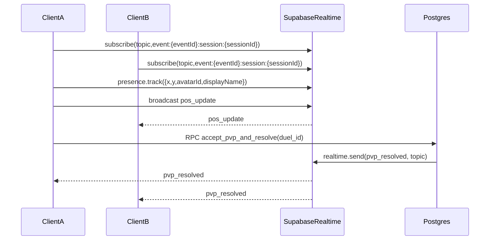

## Goals and non-goals

- **Goal**: Deliver the 3 client screens + in-map features exactly as specified (movement, presence, raise-hand queue, proximity PvP with server-random winner, kick/ban corner+hat+freeze/expel).
- **Non-goals**: Audio/voice, chat, payments, inventory, UGC, ranking/stats.

## Key decisions (based on your answers)

- **Client**: Next.js (React) web app with an embedded 2D renderer.
- **2D renderer**: PixiJS.
- **Backend**: Supabase Postgres with **SQL RPC (SECURITY DEFINER)** + RLS (no Edge Functions).

## Repository structure to create

- **Web app** (Next.js App Router): `[src/app/](src/app/)`
  - `[src/app/events/page.tsx](src/app/events/page.tsx)` (event list)
  - `[src/app/events/[eventId]/ticket/page.tsx](src/app/events/[eventId]/ticket/page.tsx)` (ticket entry + join)
  - `[src/app/events/[eventId]/session/[sessionId]/page.tsx](src/app/events/[eventId]/session/[sessionId]/page.tsx)` (2D map instance)
- **Supabase** schema/migrations: `[supabase/migrations/](supabase/migrations/)`
  - `[supabase/migrations/0001_init.sql](supabase/migrations/0001_init.sql)` (tables + indexes + RLS)
  - `[supabase/migrations/0002_rpc.sql](supabase/migrations/0002_rpc.sql)` (RPC functions)
  - `[supabase/migrations/0003_realtime.sql](supabase/migrations/0003_realtime.sql)` (realtime.messages policy + helper)
- **Client lib wrappers**
  - `[src/lib/supabase/client.ts](src/lib/supabase/client.ts)` (createClient + typed helpers)
  - `[src/lib/supabase/rpc.ts](src/lib/supabase/rpc.ts)` (join_event / raise_hand / moderation / pvp)
- **2D game code**
  - `[src/game/engine/](src/game/engine/)` (Pixi app init, loader, ticker)
  - `[src/game/world/](src/game/world/)` (map, punishmentCorner coords, collision bounds)
  - `[src/game/entities/](src/game/entities/)` (local player + remote players + hat overlay)
  - `[src/game/net/instanceChannel.ts](src/game/net/instanceChannel.ts)` (presence + broadcast handlers)
- **Assets**
  - `[public/assets/avatars/](public/assets/avatars/)` (6 base sprites)
  - `[public/assets/overlays/punishment-hat.png](public/assets/overlays/punishment-hat.png)`
  - `[public/assets/map/](public/assets/map/)` (simple auditorium + corner marker)

## Backend: schema (tables + indexes)

Implement the tables from your doc in `[supabase/migrations/0001_init.sql](supabase/migrations/0001_init.sql)`:

- `profiles(user_id pk, display_name, avatar_id)`
- `events(id pk, title, starts_at, duration_minutes, capacity, host_user_id, status)`
- `event_sessions(id pk, event_id, status)` (MVP: 1 open session per event)
- `tickets(code pk, event_id, assigned_user_id null, used_at null)`
- `hand_queue(id pk, event_id, user_id, status, created_at)`
- `penalties(id pk, event_id, user_id, type, until, created_by, created_at)`
- `pvp_duels(id pk, session_id, challenger_id, opponent_id, status, winner_id, created_at, resolved_at)`

Add only the minimal indexes needed for MVP performance:

- `tickets(event_id)`, `tickets(assigned_user_id)`
- `hand_queue(event_id, status, created_at)`
- `penalties(event_id, user_id, until)`
- `pvp_duels(session_id, status)`

## Backend: RLS policies (minimal)

In `[supabase/migrations/0001_init.sql](supabase/migrations/0001_init.sql)`:

- **profiles**: `SELECT` for authenticated; `INSERT/UPDATE` only when `user_id = auth.uid()`.
- **events**: `SELECT` for authenticated; `INSERT/UPDATE/DELETE` only for `host_user_id = auth.uid()`.
- **tickets**: `INSERT/SELECT/UPDATE` only for host of the ticket’s event. (No public “select by code”.)
- **hand_queue**: `SELECT` for host; optionally `SELECT` for the user’s own rows.
- **penalties**: `SELECT` for host and affected user.
- **pvp_duels**: `SELECT` for participants (challenger/opponent) and host (optional).

## Backend: Realtime from SQL (server-authoritative events)

Because we’re not using Edge Functions, use Supabase “Broadcast from Database” via `realtime.send()`.

- In `[supabase/migrations/0003_realtime.sql](supabase/migrations/0003_realtime.sql)` create an RLS policy on `realtime.messages` to allow authenticated clients to receive broadcasts (MVP-simple policy).
- In each RPC that needs to “broadcast” (`grant_hand`, `kick_user`, `ban_user`, `accept_pvp_and_resolve`), call:
  - `realtime.send(payload_jsonb, event_name, topic, is_private)`
  - Where `topic` is exactly `event:{eventId}:session:{sessionId}` (the client subscribes to the same string).

## Backend: RPC functions (SECURITY DEFINER)

Implement in `[supabase/migrations/0002_rpc.sql](supabase/migrations/0002_rpc.sql)`:

- **join_event(event_id, ticket_code) → session_id**
  - Lock ticket row (`FOR UPDATE`), assign if unassigned, reject if assigned to another.
  - Check active `ban` in `penalties`.
  - Create or reuse single `event_sessions` row with `status='open'`.
  - Return `session_id`.
- **raise_hand(event_id) → { ok, random_ignored }**
  - Insert or keep existing `hand_queue` row with `status='raised'`.
  - Set `random_ignored = (random() < 0.05)`.
- **grant_hand(event_id, target_user_id)** (host only)
  - Update the oldest `raised` row for that user to `granted`.
  - `realtime.send({userId}, 'hand_granted', topic, true)`.
- **kick_user(event_id, target_user_id, seconds)** (host only)
  - Insert `penalties(type='kick', until=now()+seconds)`.
  - `realtime.send({userId,type,until}, 'penalty', topic, true)`.
- **ban_user(event_id, target_user_id)** (host only)
  - Insert `penalties(type='ban', until=event_end)`.
  - `realtime.send(...)`.
- **create_pvp_duel(session_id, opponent_id) → duel_id**
  - Insert pending duel; `realtime.send({duelId,fromUserId,toUserId}, 'pvp_challenge', topic, true)`.
- **accept_pvp_and_resolve(duel_id) → { winner_id, loser_id }** (opponent only)
  - Validate caller is opponent and duel is pending.
  - Pick winner via `random()` 50/50; update duel to resolved.
  - `realtime.send({duelId,winnerId,loserId}, 'pvp_resolved', topic, true)`.

## Client: auth + profile (displayName/avatarId once)

- Add a lightweight onboarding gate component (shown before entering an event) that:
  - Ensures Supabase auth session exists (MVP recommendation: email OTP or anonymous, implemented with supabase-js).
  - Upserts `profiles` with `display_name` and `avatar_id` once; reuse on subsequent loads.

## Client: screens (3)

1. **Event list** `[src/app/events/page.tsx](src/app/events/page.tsx)`

- Query `events` (filter `status` and/or `starts_at`).
- Clicking an event routes to ticket entry.

1. **Ticket entry** `[src/app/events/[eventId]/ticket/page.tsx](src/app/events/[eventId]/ticket/page.tsx)`

- Input `ticketCode`.
- Call `rpc('join_event', { event_id, ticket_code })`.
- On success route to session page.
- On failure show minimal error.

1. **2D map instance** `[src/app/events/[eventId]/session/[sessionId]/page.tsx](src/app/events/[eventId]/session/[sessionId]/page.tsx)`

- Mount Pixi canvas, load map + sprites.
- Join Realtime channel topic `event:{eventId}:session:{sessionId}` with:
  - **Presence**: track `{ userId, displayName, avatarId, x,y,dir }`.
  - **Broadcast** (client): `pos_update` at 10–15 Hz.
  - **Broadcast** (server via realtime.send): `hand_granted`, `pvp_challenge`, `pvp_resolved`, `penalty`.

## Client: in-map mechanics

- **Movement**: keyboard input; local physics = simple velocity + bounds.
- **Remote players**: maintain per-user last two states and lerp for smoothness.
- **Raise hand**:
  - Button calls `raise_hand(event_id)`.
  - Show UI state “En cola”. If `random_ignored=true`, toast “No te vieron. Intenta de nuevo.”
  - On `hand_granted` for self: show “Turno otorgado”.
- **PvP**:
  - Compute proximity in client (radius R) to show “Desafiar”.
  - Challenge triggers `create_pvp_duel(session_id, opponent_id)`.
  - Opponent sees accept UI from `pvp_challenge` (matching `toUserId`).
  - Accept calls `accept_pvp_and_resolve(duel_id)`; clients freeze 1–2s, play a tiny 2–4 frame animation, then winner pose / loser stun.
- **Kick/Ban**:
  - On `penalty` for self:
    - Kick: teleport to punishment corner, apply hat overlay, freeze X seconds.
    - Ban: teleport + hat + short animation; then disconnect and route away; client blocks rejoin by relying on `join_event` ban check.

## Client: host overlay (only host)

Inside the map page, if `auth.uid() === events.host_user_id`:

- **Participants list** from Presence state.
- **Hand queue** from `hand_queue` table ordered by `created_at` (host can read via RLS).
- Buttons:
  - **Grant** → `grant_hand(event_id, target_user_id)`
  - **Kick** → `kick_user(event_id, target_user_id, seconds)`
  - **Ban** → `ban_user(event_id, target_user_id)`

## Realtime flow (high-level)

## Validation checklist (manual MVP)

- Create event + tickets as host.
- Join with valid ticket assigns it to user; invalid/other-user ticket fails.
- Presence shows multiple users.
- Movement broadcasts and renders smoothly.
- Raise hand inserts once; 5% ignored toast works; host can grant and target sees “Turno otorgado”.
- PvP challenge/accept resolves with server-chosen winner and both clients show outcome.
- Kick teleports+hat+freeze; Ban teleports+hat then exits and cannot rejoin.

